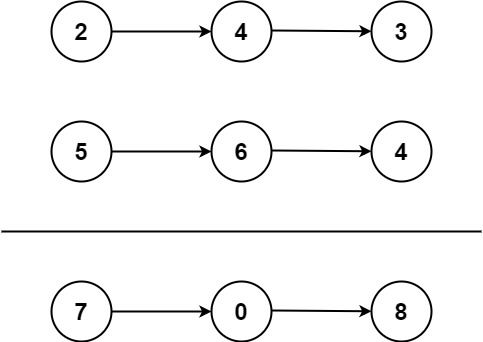

# [2. Add Two Numbers](https://leetcode.com/problems/add-two-numbers/ "Problem")

You are given two **non-empty** linked lists representing two non-negative integers. The digits are stored in 
**reverse order**, and each of their nodes contains a single digit. Add the two numbers and 
return the sum as a linked list.

You may assume the two numbers do not contain any leading zero, except the number 0 itself.

**Example 1:**

 
> **Input**: l1 = [2,4,3], l2 = [5,6,4]
> 
> **Output**: [7,0,8]
> 
> **Explanation**: 342 + 465 = 807.

**Example 2:**
> **Input**: l1 = [0], l2 = [0]
> 
> **Output**: [0]

**Example 3:**
> **Input**: l1 = [9,9,9,9,9,9,9], l2 = [9,9,9,9]
> 
> **Output**: [8,9,9,9,0,0,0,1]

**Constraints:**
+ The number of nodes in each linked list is in the range ```[1, 100]```.
+ ```0 <= Node.val <= 9```
+ It is guaranteed that the list represents a number that does not have leading zeros.

## Solutions
- [x] Python3
- [x] Go
- [x] JavaScript

## Algorithm

To solve this algorithm, we’ll create a ```dummy``` **anchor** to build the resulting list from. We’ll also need
an intermediate variable ```carry```, which will store the value ```(val1 + val2 + carry) // 10``` 
— this is necessary to **"keep the number in mind"**. Additionally, we’ll create a ```tail``` variable 
and assign it the value of dummy.

We’ll initialize **```carry``` as 0**. Then, we’ll loop through both lists until 
**both lists are exhausted** and **```carry``` becomes 0**.

On each iteration of the loop, we’ll:

1) Retrieve the values of the current list elements.
2) **Sum them together**, along with ```carry```.
3) Create a **new element** for the resulting list and set its value to ```(val1 + val2 + carry) % 10```.
4) **Recalculate ```carry```** as described earlier.
5) Assign the new element to the ```tail.next``` pointer and move ```tail``` to this new element.

In the end, we’ll have a **singly linked list** spanning from the anchor (```dummy```) to the last element.

To obtain the final answer, we need to return ```dummy.next``` (since ```dummy``` is empty by default) and
return what we get.